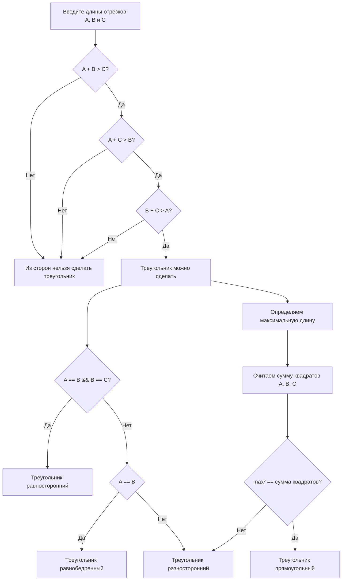

## Отчет по лабораторной работе № 1

#### № группы: `ПМ-2403`

#### Выполнил: `Нургалиев Игорь Ильнурович`

#### Вариант: `21`

### Cодержание:

- [Постановка задачи](#1-постановка-задачи)
- [Входные и выходные данные](#2-входные-и-выходные-данные)
- [Математическая модель](#25-математическая-модель)
- [Выбор структуры данных](#3-выбор-структуры-данных)
- [Алгоритм](#4-алгоритм)
- [Программа](#5-программа)
- [Анализ правильности решения](#6-анализ-правильности-решения)

### 1. Постановка задачи

> Программа получает на вход 3 числа A, B и C, не пресыщающих по модулю 10<sup>9</sup>. Нужно проверить, возможно ли составить треугольник из этих отрезков, и если да, то
определить, какой это треугольник: равносторонний, равнобедренный,
разносторонний или прямоугольный.
Данную задачу мы делаем поэтапно: Сначала надо проверить могут ли эти 3 стороны образовывать треугольник, и если да то по свойствам треугольников определить его вид
#### Пример: 
Допустим A=8 B=6 C=7 Они  могут образовать треугольник так как выполнятся свойство что сумма двух сторон треуголника больше третьей: A+B>C; B+C>A; A+C>B.
По свойствам треугольников понимаем, что это разносторонний треугольник.

### 2. Входные и выходные данные

#### Данные на вход

На вход программа должна получать 3 числа, при этом в условии сказано, что числа принадлежат натуральному множеству чиисел. 

|             | Тип                | min значение    | max значение   |
|-------------|--------------------|-----------------|----------------|
| A (Число 1) | Натуральнное число | 1               | 10<sup>9</sup> |
| B (Число 2) | Натуральнное число | 1               | 10<sup>9</sup> |
| C (Число 3) | Натуральнное число | 1               | 10<sup>9</sup> |
#### Данные на выход

Т.к. программа должна вывести название вида треугольника и сообщить, получится ли данный треугольник или не получится, то на выход мы получим либо что треугольник можно построить, а так же его вид. Либо что трееугольник нельзя посторить: "Такого треугольника не может быть", "Треугольнниик равносторонний", "Треугольник равнобедренный", "Треугольник прямоугольный", "Треугольник разносторонний".

### 2,5. Математическая модель
##### - формула для треугольника равностороннего вида: A=B=C;
##### - формула для треугольника равнобедренного вида: A=B || A=C || C=B;
##### - формула для треугольника прямоугольного вида: при помощи функции Math.max() мы находим гипотенузу, далее суммируем квадраты всех 3  значений и отнимаем гипотенузу в квадрате. Если это число будет равно гипотенузе в квадрате, то это прямоугольный треугольник;
##### - явной формулы для треугольника разностороннего вида нет, но если он пройдёт все остальные формулы и не опознает ни один из этого вида треугольников, то он и будет являться разносторонним;
### 3. Выбор структуры данных

Программа получает 3 простые целочисленные переменные. Поэтому для их хранения
можно выделить 3 переменных (`A`,`B` и `C`) типа `int`.

|             | название переменной | Тип (в Java) | 
|-------------|---------------------|--------------|
| A (Число 1) | `A`                 | `int`        |
| B (Число 2) | `B`                 | `int`        | 
| C (Число 3) | `C`                 | `int`        |

### 4. Алгоритм

#### Алгоритм выполнения программы:

1. **Ввод данных:**  
   Программа считывает три натуральных числа, обозначенные как `A`, `B` и `C`.

2. **Проверка на возможность составить треугольник из этих сторон:**  
   Программа сравнивает значения `A`, `B` и `C`. Если `A + B` > `C` или `A + C` > `B` или `B + C` > `A`, программа переходит к следующему шагу для
   работы с `A`, `B` и `C`. Если что-то меньше, то программа выдаёт, что "Из сторон нельзя сделать треугольник".

3. **Проверка вида треугольника:**
    - Если можно составить треуольник программа определяет его вид.

4. **Вывод результата:**  
   На экран выводится либо "Из сторон нельзя сделать треугольник", либо "Из сторон можно сделать треугольник" и вид данного треугольника.

#### Блок-схема



### 5. Программа
```java
import java.util.Scanner;

public class Main {
    // Объявляем объект класса Scanner для ввода данных
    public static void main(String[] args) {
        Scanner scanner = new Scanner(System.in);

        // Вводим данные
        System.out.println("Введите длины отрезков A, B и C:");
        int A = scanner.nextInt();
        int B = scanner.nextInt();
        int C = scanner.nextInt();
        // Проверка можно ли сделать треугольник
        if ((A + B > C) && (A + C > B) && (B + C > A)) {
            System.out.println("Из сторон можно сделать треугольник");
            // Определяем вид
            if((A == B) && (B == C) && (A == C)) {
                System.out.println("Треугольнниик равносторонний");
            } else if (A == B || B == C || A == C) {
                System.out.println("Треугольник равнобедренный");
            }
            int max = Math.max(A, Math.max(B, C));
            int sumOfSquares = A * A + B * B + C * C - max * max;
            if (max * max == sumOfSquares) {
                System.out.println("Треугольник прямоугольный");
            } else if (!(A == B || B == C || A == C)) {
                System.out.println("Треугольник разносторонний");
            }
        } else {
            System.out.println("Из сторон нельзя сделать треугольник");
        }
        scanner.close();    
    }
}


```
### 6. Анализ правильности решения
Программа работает корректно на всем множестве решений с учетом ограничений.
Проводим серию тестов для каждого вида треуольника и для случая когда мы не можем его посторить.
1. Тест на `A = 1, B = 3, C = 5`:

- **Input**:
        ```
        1 3 5
        ```

    - **Output**:
        ```
        "Из сторон нельзя сделать треугольник"
        ```

2. Тест на `A = 2, B = 2, C = 3`:

- **Input**:
        ```
        2 2 3
        ```

    - **Output**:
        ```
        "Из сторон можно сделать треугольник"
        "Треугольник равнобедренный"
        ```

3. Тест на `A = 2, B = 2, C = 2`:

- **Input**:
         ```
        2 2 2
         ```

    - **Output**:
        ```
        "Из сторон можно сделать треугольник"
        "Треугольнниик равносторонний"
        ```

4. Тест на `A = 4, B = 3, C = 5`:

- **Input**:
         ```
        4 3 5
         ```

    - **Output**:
        ```
        "Из сторон можно сделать треугольник"
        "Треугольник прямоугольный"
        ```

5. Тест на `A = 10, B = 9, C = 8`:

- **Input**:
         ```
        10 9 8
         ```

    - **Output**:
        ```
        "Из сторон можно сделать треугольник"
        "Треугольник разносторонний"
        ```

6. Тест на максимум `A = 1000000000, B = 1000000000, C = 1000000000`:

- **Input**:
         ```
        1000000000 1000000000 1000000000
         ```

    - **Output**:
        ```
        "Из сторон можно сделать треугольник"
        "Треугольнниик равносторонний"
